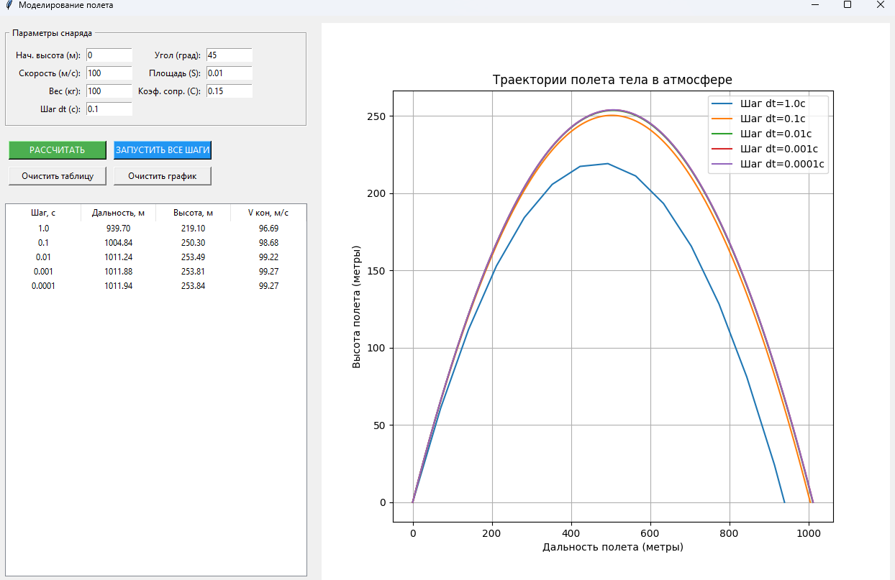

# Математическая модель баллистического полета

Данное приложение моделирует траекторию движения тела, запущенного под углом к горизонту в земной атмосфере.

---

## 1. Физическая постановка задачи

На тело в полете действуют две основные силы:
1.  **Сила тяжести**: $F_g = mg$, направлена вертикально вниз.
2.  **Сила сопротивления воздуха**: $F_d = \frac{1}{2} C \rho S v^2$, направлена противоположно вектору текущей скорости.

### Параметры модели:
* **m** — масса тела (кг)
* **g** — ускорение свободного падения ($9.81 \, м/с^2$)
* **C** — коэффициент сопротивления
* **ρ** — плотность воздуха ($1.225 \, кг/м^3$)
* **S** — площадь поперечного сечения тела ($м^2$)
* **v** — мгновенная скорость тела ($м/с$)

---

## 2. Дифференциальные уравнения движения

Согласно второму закону Ньютона ($F = ma$), ускорение тела в каждый момент времени можно разложить на составляющие по осям координат $Ox$ и $Oy$:

$$a_x = -\frac{k}{m} \cdot v \cdot v_x$$
$$a_y = -g - \frac{k}{m} \cdot v \cdot v_y$$

Где $k$ — обобщенный коэффициент сопротивления среды:
$$k = \frac{C \cdot S \cdot \rho}{2}$$

---

## 3. Численное решение

Так как ускорение зависит от скорости, задача решается численным методом интегрирования с шагом по времени $\Delta t$.

Алгоритм итерации:
1.  **Вычисление полной скорости**:
    $$v = \sqrt{v_x^2 + v_y^2}$$
2.  **Обновление скоростей**:
    $$v_{x_{i+1}} = v_{x_i} + a_x \cdot \Delta t$$
    $$v_{y_{i+1}} = v_{y_i} + a_y \cdot \Delta t$$
3.  **Обновление координат**:
    $$x_{i+1} = x_i + v_{x_{i+1}} \cdot \Delta t$$
    $$y_{i+1} = y_i + v_{y_{i+1}} \cdot \Delta t$$

---

## 4. Сходимость метода

Приложение позволяет сравнивать результаты при разных шагах интегрирования (от $1.0$ до $0.0001$). Это наглядно демонстрирует фундаментальное свойство численных методов: **с уменьшением шага $\Delta t$ расчетная траектория стремится к истинному аналитическому решению**.

При начальной скорости = 100 м/c, вес = 100 кг, S = 0.01, C = 0.15 получились следующие результаты:

| Шаг моделирования, с | 1 | 0.1 | 0.01 | 0.001 | 0.0001 |
|----------------------|---|-----|------|-------|--------|
| Дальность полёта, м | 939.70  | 1004.84    | 1011.24     | 1011.88      | 1011.94       |
| Максимальная высота, м | 219.1|250.3 |253.49 |253.81 |253.84 |
| Скорость в конечной точке, м/с |96.69 |98.68 |99.22 |99.27 |99.27 |

---

## 5. Вывод

Моделирование подтверждает, что при уменьшении шага результаты стабилизуются. Разница между шагами 0.001 и 0.0001 ничтожна мала.
Использование крупного шага (1.0 с) ведет к занижению дальности полета из-за редкого пересчета ускорения. 

