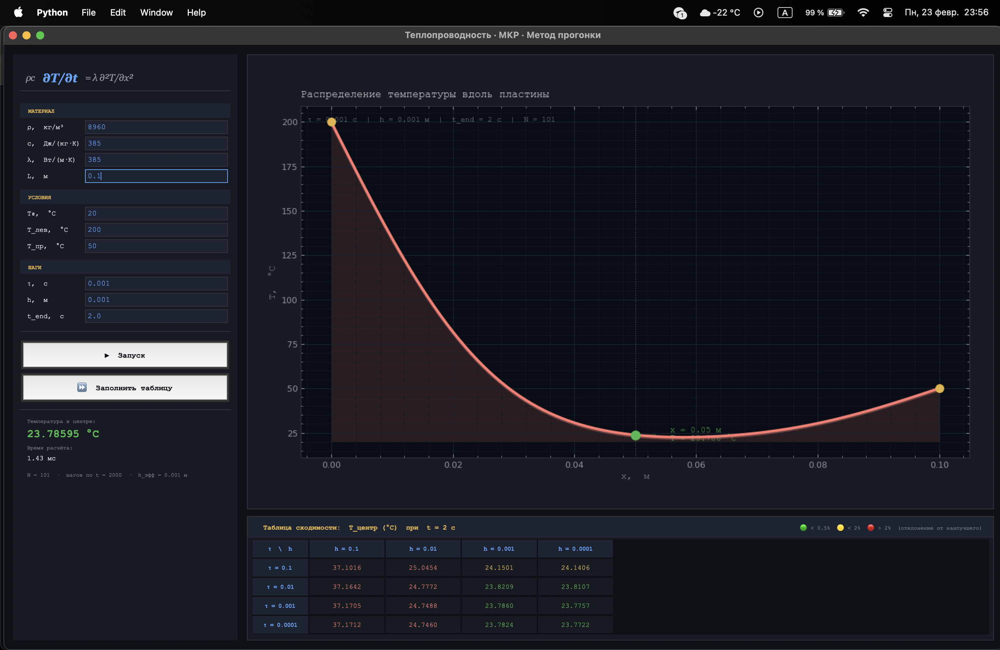

## Параметры материала (Медь):
* Плотность ($\rho$): 8960 кг/м³
* Теплоемкость ($c$): 385 Дж/(кг·К)
* Теплопроводность ($\lambda$): 385 Вт/(м·К)
* Длина ($L$): 0.1 м (10 см)

### Условия
* Начальная температура: 20°C
* Граничные условия: 200°C (слева) и 50°C (справа)
* Время процесса ($t_{end}$): 2.0 с

---

## Результаты расчетов
| Шаг по времени, с \ Шаг по пространству, м | 0.1 | 0.01 | 0.001 | 0.0001 |
|-------------------------------------------|-----|------|-------|--------|
| 0.1 |37.1016 |25.0454 |24.1501 |24.1406 |
| 0.01 |37.1642 |24.7772 |23.8209 |23.8107 |
| 0.001 |37.1705 |24.7488 |23.7860|23.7757 |
| 0.0001 |37.1712 |24.7460 |23.7824 |23.7722 |

---

## Вывод

* Сходимость: При уменьшении шагов $h$ и $\tau$ значение в центре стабилизируется на отметке 23.77 – 23.78 °C. Это доказывает корректность работы алгоритма.

* Погрешность: При самом грубом шаге ($h=0.1$, что равно всей длине пластины) погрешность составляет более 13 °C ($37.17$ против $23.77$). Это еще раз подтверждает необходимость использования мелкой сетки ($h \le 0.001$) для получения достоверных физических данных

